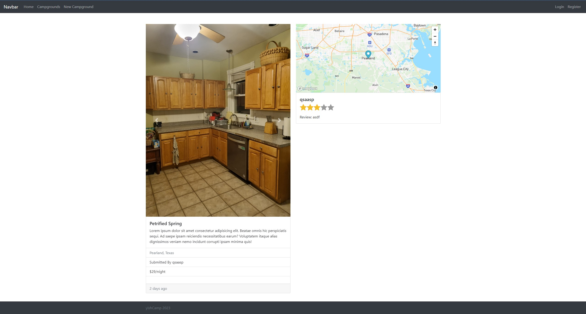

<h1 align="center"> yishCamp - Camp Review Website </h1>

    
     
    <i>Home Screen</i>

<!-- START doctoc generated TOC please keep comment here to allow auto update -->
<!-- DON'T EDIT THIS SECTION, INSTEAD RE-RUN doctoc TO UPDATE -->
# Table of Contents

- [About](#About)
- [Prerequisites](#prerequisites)
- [Getting Started](#getting-started)
- [Deploy](#deploy)
- [Sample Screens](#sample-screens)

<!-- END doctoc generated TOC please keep comment here to allow auto update -->

 

# About

This is a full-stack camp review website built from scracth using MongoDB as a database, Express.js, Node.js as a backend server and ejs template for the frontend. This camp review website supports RESTful API CRUD operations.

 

# Prerequisites
* node >= 18
* npm >= 9.5

 

# Getting Started

### `npm install`
Run this command to install node modules.

### `npm start`

Open [http://localhost:3000](http://localhost:3000) to view it in your browser.

### `nodemon run`

Runs the app in the development mode. Open [http://localhost:3000](http://localhost:3000) to view it in your browser.

The page will reload when you make changes.

 

# Deploy

Deployed the app on heroku.

# Sample Screens

    
     
    <i>- Main Screen -</i>

    
     
    <i>- Detail Page -</i>

    
     
    <i>- Login Screen -</i>

    
     
    <i>- Edit Screen -</i>

